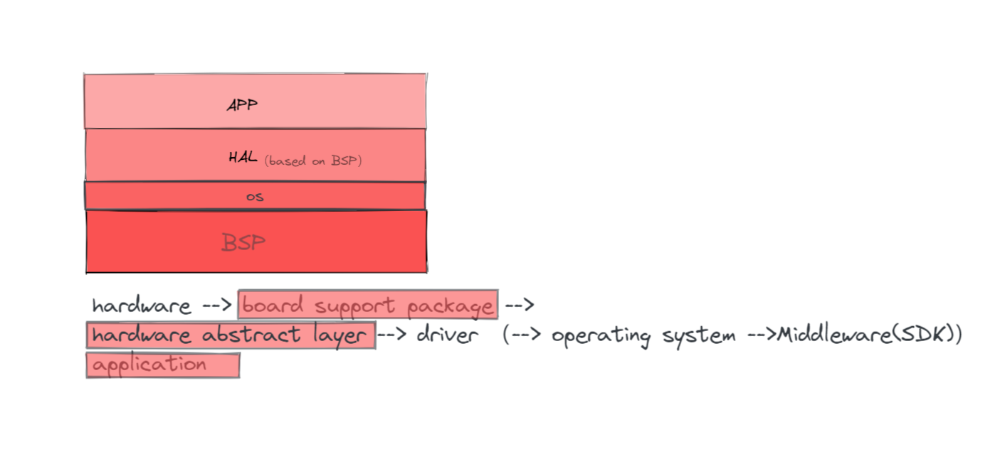

### Framework

## HOW TO USE 

### 1 . (ENV. : Arduino)

#### HAL - Abstract a hardware Device

#### APP - Abstract a software device

#### Main - Init HAL & APP

 [template.cpp](./src/template.cpp)  [template.h](./src/template.h) 

### 2. (ENV. : STC32G)

**TODO**

### 3. (ENV. : STM32Fxx)

**TODO**

